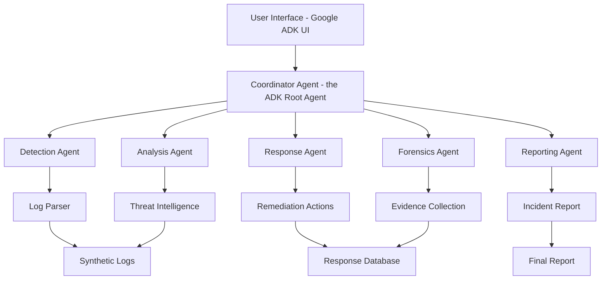
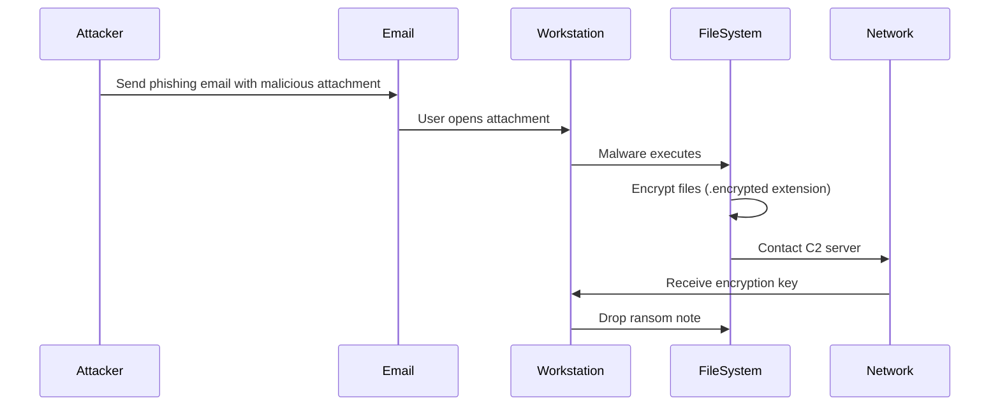
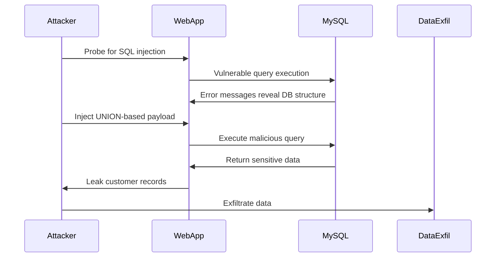
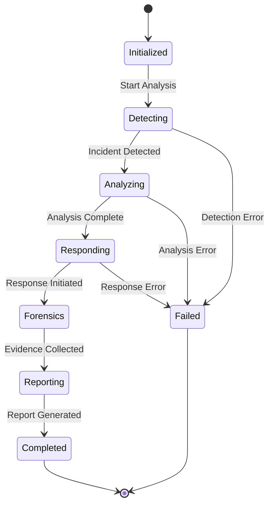
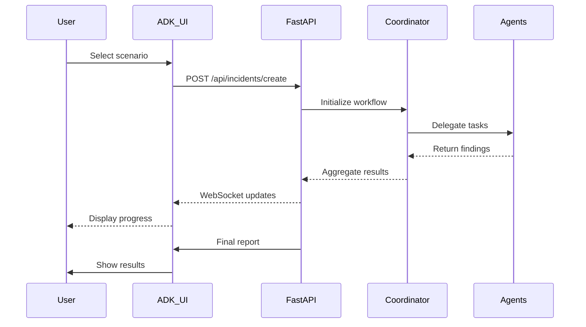

# Security Incident Response Multi-Agent System - Project Plan

## Project Overview

A multi-agent web application demonstrating automated security incident response for two critical scenarios:
1. **Windows Workstation Ransomware Attack**
2. **Website Data Breach via SQL Injection**

**Technology Stack:**
- Backend: Python with FastAPI
- AI Framework: Google ADK (Vertex AI using local gcloud credentials)
- LLM: gemini-2.5-flash
- UI: Default Google ADK UI
- Agent Architecture: Collaborative multi-agent system with coordinator
- Define each sub-agent and subagent's tools in a separate folder

---

## System Architecture

### Multi-Agent Design Pattern



### Agent Roles and Responsibilities

#### 1. Coordinator Agent (the ADK Root Agent)
- **Role:** Orchestrates the incident response workflow
- **Responsibilities:**
  - Receives incident alerts
  - Delegates tasks to specialized agents
  - Aggregates results from all agents
  - Manages agent communication and state
  - Provides status updates to UI

#### 2. Detection Agent (Triaging Agent)
- **Role:** Identifies security incidents from logs and performs initial threat intelligence mapping
- **Responsibilities:**
  - Parses synthetic log files
  - Identifies anomalous patterns
  - Classifies incident type (ransomware vs data breach)
  - Extracts key indicators of compromise (IOCs)
  - **Performs threat intelligence mapping** (maps IOCs to known threat databases)
  - Enriches findings with threat context (malware families, threat actors, TTPs)
  - Triggers alert to coordinator with enriched data

#### 3. Analysis Agent
- **Role:** Deep-dive analysis of detected incidents
- **Responsibilities:**
  - Analyzes attack vectors and techniques
  - Maps to MITRE ATT&CK framework
  - Assesses impact and scope
  - Identifies affected systems/data
  - Determines attack timeline

#### 4. Response Agent
- **Role:** Recommends and executes containment actions
- **Responsibilities:**
  - Suggests immediate containment steps
  - Provides remediation recommendations
  - Simulates response actions (isolation, blocking, patching)
  - Tracks response effectiveness
  - Updates incident status

#### 5. Forensics Agent
- **Role:** Collects and preserves evidence
- **Responsibilities:**
  - Identifies critical evidence from logs
  - Creates forensic timeline
  - Preserves chain of custody
  - Extracts artifacts (file hashes, IP addresses, SQL queries)
  - Documents technical details

#### 6. Reporting Agent
- **Role:** Generates comprehensive incident reports
- **Responsibilities:**
  - Compiles findings from all agents
  - Creates executive summary
  - Generates technical details
  - Provides lessons learned
  - Suggests preventive measures

---

## Incident Scenarios

### Scenario 1: Windows Workstation Ransomware Attack

#### Attack Flow


#### Synthetic Log Events

**Windows Event Logs:**
```
Event ID 4688 - Process Creation
- Timestamp: 2024-01-15 14:23:45
- Process: suspicious_invoice.exe
- Parent Process: outlook.exe
- User: WORKSTATION\john.doe

Event ID 5145 - Network Share Access
- Timestamp: 2024-01-15 14:24:12
- Share: \\WORKSTATION\C$\Users\john.doe\Documents
- Access: WriteData

Event ID 4663 - File System Access
- Timestamp: 2024-01-15 14:24:30
- Object: C:\Users\john.doe\Documents\report.docx.encrypted
- Access: WriteData
```

**Network Logs:**
```
Timestamp: 2024-01-15 14:25:00
Source IP: 192.168.1.105
Destination IP: 185.220.101.45 (C2 Server)
Port: 443
Protocol: HTTPS
Bytes Sent: 2048
Bytes Received: 4096
```

**File System Logs:**
```
Timestamp: 2024-01-15 14:24:15
Action: File Renamed
Original: C:\Users\john.doe\Documents\report.docx
New: C:\Users\john.doe\Documents\report.docx.encrypted

Timestamp: 2024-01-15 14:26:30
Action: File Created
Path: C:\Users\john.doe\Desktop\RANSOM_NOTE.txt
Size: 1024 bytes
```

#### Expected Agent Responses

- **Detection:** Identifies ransomware based on mass file encryption pattern
- **Analysis:** Maps to MITRE T1486 (Data Encrypted for Impact)
- **Response:** Isolate workstation, block C2 IP, restore from backup
- **Forensics:** Extract malware hash, C2 IP, encrypted file list
- **Reporting:** Generate incident timeline and remediation steps

---

### Scenario 2: Website Data Breach via SQL Injection

#### Attack Flow


#### Synthetic Log Events

**Web Server Access Logs:**
```
192.168.1.200 - - [15/Jan/2024:15:30:12 +0000] "GET /products?id=1' OR '1'='1 HTTP/1.1" 200 5432
192.168.1.200 - - [15/Jan/2024:15:30:45 +0000] "GET /products?id=1' UNION SELECT NULL,NULL,NULL-- HTTP/1.1" 200 3421
192.168.1.200 - - [15/Jan/2024:15:31:20 +0000] "GET /products?id=1' UNION SELECT username,password,email FROM users-- HTTP/1.1" 200 15678
```

**MySQL Query Logs:**
```
Timestamp: 2024-01-15 15:30:12
Query: SELECT * FROM products WHERE id='1' OR '1'='1'
Duration: 0.045s
Rows: 150

Timestamp: 2024-01-15 15:31:20
Query: SELECT * FROM products WHERE id='1' UNION SELECT username,password,email FROM users--'
Duration: 0.123s
Rows: 5000
Warning: Suspicious UNION query detected
```

**Application Error Logs:**
```
[2024-01-15 15:30:12] ERROR: SQL syntax error near 'OR '1'='1''
[2024-01-15 15:30:45] WARNING: Multiple NULL columns in UNION query
[2024-01-15 15:31:20] CRITICAL: Unauthorized access to users table
```

**Network Traffic Logs:**
```
Timestamp: 2024-01-15 15:31:25
Source IP: 192.168.1.200
Destination IP: 203.0.113.50 (External)
Protocol: HTTPS
Bytes Transferred: 2.5 MB
Connection Duration: 45 seconds
```

#### Expected Agent Responses

- **Detection:** Identifies SQL injection via malicious query patterns
- **Analysis:** Maps to MITRE T1190 (Exploit Public-Facing Application)
- **Response:** Block attacker IP, patch vulnerable endpoint, reset credentials
- **Forensics:** Extract SQL payloads, affected records, attacker IP
- **Reporting:** Generate breach notification and compliance report

---

## Project Structure

```
IR-BOT/
├── README.md
├── PROJECT_PLAN.md
├── requirements.txt
├── .env.example
├── .gitignore
│
├── src/
│   ├── __init__.py
│   ├── main.py                      # FastAPI application entry point
│   ├── config.py                    # Configuration management
│   │
│   ├── agents/
│   │   ├── __init__.py
│   │   ├── base_agent.py            # Base agent class
│   │   ├── coordinator_agent.py     # Orchestrator agent
│   │   ├── detection_agent.py       # Incident detection
│   │   ├── analysis_agent.py        # Threat analysis
│   │   ├── response_agent.py        # Incident response
│   │   ├── forensics_agent.py       # Evidence collection
│   │   └── reporting_agent.py       # Report generation
│   │
│   ├── models/
│   │   ├── __init__.py
│   │   ├── incident.py              # Incident data models
│   │   ├── log_entry.py             # Log entry models
│   │   └── response.py              # Response action models
│   │
│   ├── services/
│   │   ├── __init__.py
│   │   ├── gemini_service.py        # Google ADK integration
│   │   ├── log_parser.py            # Log parsing utilities
│   │   └── mitre_mapper.py          # MITRE ATT&CK mapping
│   │
│   ├── api/
│   │   ├── __init__.py
│   │   ├── routes.py                # API endpoints
│   │   └── websocket.py             # Real-time updates
│   │
│   └── utils/
│       ├── __init__.py
│       ├── logger.py                # Application logging
│       └── helpers.py               # Utility functions
│
├── data/
│   ├── synthetic_logs/
│   │   ├── ransomware/
│   │   │   ├── windows_events.json
│   │   │   ├── network_traffic.json
│   │   │   └── filesystem_events.json
│   │   │
│   │   └── sql_injection/
│   │       ├── web_access.log
│   │       ├── mysql_query.log
│   │       ├── app_error.log
│   │       └── network_traffic.json
│   │
│   ├── mitre_attack/
│   │   └── techniques.json          # MITRE ATT&CK reference data
│   │
│   └── threat_intel/
│       └── ioc_database.json        # Known IOCs
│
├── tests/
│   ├── __init__.py
│   ├── test_agents.py
│   ├── test_log_parser.py
│   └── test_api.py
│
├── docs/
│   ├── API.md                       # API documentation
│   ├── AGENTS.md                    # Agent architecture details
│   └── DEPLOYMENT.md                # Deployment guide
│
└── scripts/
    ├── generate_logs.py             # Synthetic log generator
    ├── setup_db.py                  # Database initialization
    └── run_demo.py                  # Demo scenario runner
```

---

## API Design

### Core Endpoints

#### 1. Incident Management
```
POST /api/incidents/create
- Create new incident from log upload
- Request: { "scenario": "ransomware|sqli", "logs": [...] }
- Response: { "incident_id": "uuid", "status": "processing" }

GET /api/incidents/{incident_id}
- Get incident details and current status
- Response: { "incident": {...}, "agents": [...], "timeline": [...] }

GET /api/incidents/{incident_id}/status
- Get real-time processing status
- Response: { "phase": "detection|analysis|response", "progress": 75 }
```

#### 2. Agent Communication
```
GET /api/agents/status
- Get status of all agents
- Response: { "agents": [{"name": "detection", "status": "active", "task": "..."}] }

POST /api/agents/coordinate
- Trigger coordinator agent workflow
- Request: { "incident_id": "uuid", "priority": "high" }
- Response: { "workflow_id": "uuid", "agents_assigned": [...] }
```

#### 3. Reports
```
GET /api/reports/{incident_id}
- Get comprehensive incident report
- Response: { "executive_summary": "...", "technical_details": {...}, "recommendations": [...] }

GET /api/reports/{incident_id}/export
- Export report in various formats
- Query params: format=pdf|json|html
```

#### 4. WebSocket for Real-time Updates
```
WS /ws/incidents/{incident_id}
- Real-time agent updates
- Messages: { "agent": "detection", "status": "completed", "findings": [...] }
```

---

## Agent Communication Protocol

### Message Format
```json
{
  "message_id": "uuid",
  "timestamp": "2024-01-15T15:30:00Z",
  "from_agent": "detection",
  "to_agent": "coordinator",
  "message_type": "finding|request|response|status",
  "priority": "low|medium|high|critical",
  "payload": {
    "incident_id": "uuid",
    "data": {}
  }
}
```

### Workflow States


---

## Implementation Phases

### Phase 1: Foundation (Week 1)
- [ ] Set up project structure
- [ ] Configure FastAPI application
- [ ] Integrate Google ADK (Gemini API)
- [ ] Create base agent class
- [ ] Implement basic logging

### Phase 2: Synthetic Data (Week 1-2)
- [ ] Generate ransomware scenario logs
- [ ] Generate SQL injection scenario logs
- [ ] Create log parser utilities
- [ ] Build MITRE ATT&CK reference data
- [ ] Populate threat intelligence database

### Phase 3: Agent Development (Week 2-3)
- [ ] Implement Coordinator Agent
- [ ] Implement Detection Agent
- [ ] Implement Analysis Agent
- [ ] Implement Response Agent
- [ ] Implement Forensics Agent
- [ ] Implement Reporting Agent
- [ ] Test agent communication

### Phase 4: API & Integration (Week 3-4)
- [ ] Build REST API endpoints
- [ ] Implement WebSocket for real-time updates
- [ ] Integrate with Google ADK UI
- [ ] Create incident workflow orchestration
- [ ] Add error handling and validation

### Phase 5: Testing & Demo (Week 4)
- [ ] Unit tests for all agents
- [ ] Integration tests for workflows
- [ ] End-to-end scenario testing
- [ ] Performance optimization
- [ ] Create demo scripts
- [ ] Documentation

---

## Google ADK UI Integration

### Configuration
```python
# Google ADK UI will connect to FastAPI backend
# Default UI provides:
# - Chat interface for user interaction
# - Agent status visualization
# - Real-time updates display
# - Report viewing

# Backend provides:
# - RESTful API for UI communication
# - WebSocket for real-time agent updates
# - Structured responses for UI rendering
```

### UI Flow


---

## Key Technologies & Libraries

### Core Dependencies
```
fastapi==0.104.1
uvicorn==0.24.0
google-generativeai==0.3.1
pydantic==2.5.0
python-dotenv==1.0.0
websockets==12.0
```

### Additional Libraries
```
pandas==2.1.3              # Log data processing
python-json-logger==2.0.7  # Structured logging
aiohttp==3.9.1             # Async HTTP requests
pytest==7.4.3              # Testing
pytest-asyncio==0.21.1     # Async testing
```

---

## Coding Guidelines and Best Practices

### Code Quality Standards

#### 1. Efficiency and Simplicity
- **Keep it Simple:** Write clear, readable code that solves the problem directly
- **Avoid Over-Engineering:** Don't add complexity unless absolutely necessary
- **Use Built-in Functions:** Leverage Python's standard library and ADK built-in tools
- **Optimize for Readability:** Code should be self-documenting where possible

#### 2. Google ADK Built-in Tools Integration
The project will leverage Google ADK's built-in capabilities:

**Google Search Tool:**
```python
# Example: Using ADK's built-in Google Search for threat intelligence
from google.adk.agents import Agent
from google.adk.tools import google_search

# Create agent with Google Search tool enabled
detection_agent = Agent(
    name="detection_agent",
    model="gemini-2.0-flash",
    description="Agent to detect security incidents and perform threat intelligence mapping",
    instruction="Analyze security logs and enrich IOCs with threat intelligence",
    tools=[google_search]  # Enable Google Search for real-time threat intelligence lookups
)

# Use in Detection/Triaging Agent to enrich IOCs
# Example: Search for IP reputation, malware hash lookups, CVE details
# The agent can now perform web searches to gather threat intelligence
```

**Code Execution Tool:**
```python
# Example: Using ADK's built-in Code Execution for log analysis automation
from google.adk.agents import LlmAgent
from google.adk.code_executors import BuiltInCodeExecutor

# Create agent with Code Execution capability
analysis_agent = LlmAgent(
    name="analysis_agent",
    model="gemini-2.0-flash",
    code_executor=BuiltInCodeExecutor()  # Enable code execution for automated analysis
)

# Use in Analysis Agent to process and analyze log data programmatically
# Example: Parse timestamps, calculate statistics, identify patterns
# The agent can execute Python code to perform data analysis tasks
```

**Other ADK Built-in Capabilities:**
- Function calling for structured data extraction from logs
- Grounding with Google Search for up-to-date threat intelligence
- Multi-turn conversations for interactive incident analysis
- Code execution for automated log parsing and statistical analysis

#### 3. Code Documentation Standards

**File-level Documentation:**
```python
"""
Module: detection_agent.py
Purpose: Triaging agent that detects security incidents and performs threat intelligence mapping
Author: [Your Name]
Created: 2024-01-15
Last Modified: 2024-01-15

This module implements the Detection/Triaging Agent responsible for:
1. Parsing synthetic security logs
2. Identifying anomalous patterns indicating security incidents
3. Extracting indicators of compromise (IOCs)
4. Mapping IOCs to threat intelligence databases
5. Enriching findings with threat context

Dependencies:
- google.adk: For AI-powered log analysis and agent framework
- pandas: For log data processing
- json: For log parsing
"""
```

**Class-level Documentation:**
```python
class DetectionAgent(BaseAgent):
    """
    Detection/Triaging Agent for security incident identification.
    
    This agent serves as the first line of defense in the incident response
    workflow. It analyzes logs, detects anomalies, and enriches findings
    with threat intelligence before passing to the Analysis Agent.
    
    Attributes:
        agent_name (str): Unique identifier for this agent
        gemini_model: Google Gemini model instance for AI analysis
        threat_intel_db (dict): Local threat intelligence database
        google_search: ADK Google Search tool for real-time lookups
        
    Methods:
        analyze_logs(): Parse and analyze security logs
        detect_anomalies(): Identify suspicious patterns
        extract_iocs(): Extract indicators of compromise
        enrich_with_threat_intel(): Map IOCs to threat databases
        classify_incident(): Determine incident type and severity
    """
```

**Function-level Documentation:**
```python
def enrich_with_threat_intel(self, iocs: List[str]) -> Dict[str, Any]:
    """
    Enrich extracted IOCs with threat intelligence data.
    
    This function takes a list of IOCs (IP addresses, file hashes, domains)
    and enriches them with context from both local threat intelligence
    databases and real-time Google Search lookups.
    
    Args:
        iocs (List[str]): List of indicators of compromise to enrich
            Examples: ['185.220.101.45', 'a3f5d8e9...', 'malicious.com']
    
    Returns:
        Dict[str, Any]: Enriched threat intelligence data containing:
            - ioc_type: Type of indicator (ip, hash, domain)
            - threat_level: Severity rating (low, medium, high, critical)
            - known_malware: Associated malware families
            - threat_actors: Known threat actor groups
            - first_seen: First observation timestamp
            - references: External threat intelligence sources
    
    Raises:
        ValueError: If IOC format is invalid
        ConnectionError: If Google Search API is unavailable
    
    Example:
        >>> iocs = ['185.220.101.45', 'a3f5d8e9b2c1...']
        >>> enriched = agent.enrich_with_threat_intel(iocs)
        >>> print(enriched['185.220.101.45']['threat_level'])
        'high'
    """
    # Implementation with inline comments
    enriched_data = {}
    
    for ioc in iocs:
        # Step 1: Validate IOC format
        ioc_type = self._validate_ioc_format(ioc)
        
        # Step 2: Check local threat intelligence database first
        local_intel = self._query_local_threat_db(ioc)
        
        # Step 3: If not found locally, use Google Search for real-time lookup
        if not local_intel:
            search_query = f"threat intelligence {ioc_type} {ioc}"
            search_results = self.google_search.search(search_query)
            local_intel = self._parse_search_results(search_results)
        
        # Step 4: Combine and structure the enriched data
        enriched_data[ioc] = {
            'ioc_type': ioc_type,
            'threat_level': local_intel.get('severity', 'unknown'),
            'known_malware': local_intel.get('malware_families', []),
            'threat_actors': local_intel.get('actors', []),
            'first_seen': local_intel.get('first_seen', 'unknown'),
            'references': local_intel.get('sources', [])
        }
    
    return enriched_data
```

**Inline Comments:**
```python
# Use inline comments for complex logic, not obvious code
# Good:
# Calculate risk score based on weighted factors (severity * 0.4 + frequency * 0.3 + impact * 0.3)
risk_score = (severity * 0.4) + (frequency * 0.3) + (impact * 0.3)

# Bad (don't comment obvious code):
# Increment counter by 1
counter += 1
```

#### 4. Error Handling and Logging

**Comprehensive Error Handling:**
```python
import logging
from typing import Optional

logger = logging.getLogger(__name__)

async def process_incident(self, incident_id: str) -> Optional[Dict]:
    """Process security incident with comprehensive error handling."""
    try:
        # Attempt to load incident data
        incident_data = await self._load_incident(incident_id)
        
        # Validate incident data structure
        if not self._validate_incident_data(incident_data):
            logger.warning(f"Invalid incident data structure for {incident_id}")
            return None
        
        # Process with timeout protection
        result = await asyncio.wait_for(
            self._analyze_incident(incident_data),
            timeout=30.0  # 30 second timeout
        )
        
        logger.info(f"Successfully processed incident {incident_id}")
        return result
        
    except asyncio.TimeoutError:
        logger.error(f"Timeout processing incident {incident_id}")
        return {"status": "timeout", "incident_id": incident_id}
        
    except ValueError as e:
        logger.error(f"Validation error for incident {incident_id}: {str(e)}")
        return {"status": "validation_error", "error": str(e)}
        
    except Exception as e:
        # Catch-all for unexpected errors
        logger.exception(f"Unexpected error processing incident {incident_id}")
        return {"status": "error", "error": str(e)}
```

#### 5. Type Hints and Validation

**Use Type Hints Throughout:**
```python
from typing import List, Dict, Optional, Union, Any
from pydantic import BaseModel, Field, validator

class IncidentData(BaseModel):
    """Pydantic model for incident data validation."""
    
    incident_id: str = Field(..., description="Unique incident identifier")
    incident_type: str = Field(..., description="Type: ransomware or sqli")
    timestamp: str = Field(..., description="ISO 8601 timestamp")
    severity: str = Field(..., description="Severity: low, medium, high, critical")
    iocs: List[str] = Field(default_factory=list, description="List of IOCs")
    
    @validator('incident_type')
    def validate_incident_type(cls, v):
        """Ensure incident type is valid."""
        allowed_types = ['ransomware', 'sqli']
        if v not in allowed_types:
            raise ValueError(f"incident_type must be one of {allowed_types}")
        return v
    
    @validator('severity')
    def validate_severity(cls, v):
        """Ensure severity level is valid."""
        allowed_levels = ['low', 'medium', 'high', 'critical']
        if v not in allowed_levels:
            raise ValueError(f"severity must be one of {allowed_levels}")
        return v
```

#### 6. Testing Requirements

**Unit Test Example:**
```python
import pytest
from src.agents.detection_agent import DetectionAgent

class TestDetectionAgent:
    """Test suite for Detection/Triaging Agent."""
    
    @pytest.fixture
    def agent(self):
        """Create agent instance for testing."""
        return DetectionAgent(agent_name="test_detection")
    
    @pytest.mark.asyncio
    async def test_detect_ransomware(self, agent):
        """Test ransomware detection from synthetic logs."""
        # Arrange: Load test logs
        test_logs = self._load_test_logs('ransomware')
        
        # Act: Run detection
        result = await agent.analyze_logs(test_logs)
        
        # Assert: Verify detection
        assert result['incident_type'] == 'ransomware'
        assert result['severity'] in ['high', 'critical']
        assert len(result['iocs']) > 0
        assert 'C2' in result['findings']
    
    def test_ioc_enrichment(self, agent):
        """Test threat intelligence enrichment."""
        # Arrange: Sample IOCs
        iocs = ['185.220.101.45', 'malicious.exe']
        
        # Act: Enrich IOCs
        enriched = agent.enrich_with_threat_intel(iocs)
        
        # Assert: Verify enrichment
        assert '185.220.101.45' in enriched
        assert enriched['185.220.101.45']['ioc_type'] == 'ip'
        assert 'threat_level' in enriched['185.220.101.45']
```

#### 7. Performance Optimization

**Async/Await for Concurrent Operations:**
```python
import asyncio
from typing import List

async def process_multiple_agents(self, incident_id: str) -> Dict:
    """
    Run multiple agents concurrently for faster processing.
    
    This function demonstrates efficient parallel agent execution
    using asyncio to reduce total processing time.
    """
    # Create tasks for parallel execution
    tasks = [
        self.detection_agent.analyze(incident_id),
        self.forensics_agent.collect_evidence(incident_id),
        self.analysis_agent.assess_impact(incident_id)
    ]
    
    # Execute all agents concurrently
    results = await asyncio.gather(*tasks, return_exceptions=True)
    
    # Process results and handle any exceptions
    return self._aggregate_results(results)
```

**Caching for Repeated Lookups:**
```python
from functools import lru_cache

@lru_cache(maxsize=1000)
def get_mitre_technique(self, technique_id: str) -> Dict:
    """
    Get MITRE ATT&CK technique details with caching.
    
    Uses LRU cache to avoid repeated file reads for the same technique.
    """
    return self._load_mitre_data(technique_id)
```

#### 8. Configuration Management

**Environment Variables:**
```python
# config.py
from pydantic_settings import BaseSettings
from typing import Optional

class Settings(BaseSettings):
    """
    Application settings loaded from environment variables.
    
    All sensitive data (API keys, secrets) should be stored in .env file
    and never committed to version control.
    """
    
    # Google ADK Configuration
    google_api_key: str  # Required: Google Gemini API key
    gemini_model: str = "gemini-1.5-pro"  # Default model
    
    # Application Configuration
    app_name: str = "IR-BOT"
    debug_mode: bool = False
    log_level: str = "INFO"
    
    # API Configuration
    api_host: str = "0.0.0.0"
    api_port: int = 8000
    cors_origins: List[str] = ["http://localhost:3000"]
    
    # Agent Configuration
    max_agent_timeout: int = 30  # seconds
    enable_google_search: bool = True
    
    class Config:
        env_file = ".env"
        env_file_encoding = "utf-8"

# Usage
settings = Settings()
```

---

## Security Considerations

### API Security
- API key authentication for Google ADK
- Rate limiting on endpoints
- Input validation and sanitization
- CORS configuration for UI

### Data Security
- No real sensitive data (synthetic logs only)
- Secure storage of API keys in environment variables
- Logging sanitization (no credentials in logs)

### Agent Security
- Sandboxed agent execution
- Resource limits per agent
- Timeout mechanisms
- Error isolation

---

## Success Metrics

### Functional Requirements
- ✅ Successfully detect both incident types from logs
- ✅ Agents collaborate and share findings
- ✅ Generate comprehensive incident reports
- ✅ Real-time status updates via UI
- ✅ Complete workflow in < 30 seconds

### Technical Requirements
- ✅ API response time < 200ms
- ✅ WebSocket latency < 100ms
- ✅ Agent processing time < 5s per agent
- ✅ 100% test coverage for critical paths
- ✅ Zero data loss during agent communication

---

## Demo Scenarios

### Demo 1: Ransomware Response
1. User selects "Ransomware Scenario"
2. System loads synthetic Windows logs
3. Detection Agent identifies encryption activity
4. Analysis Agent maps to MITRE T1486
5. Response Agent suggests isolation
6. Forensics Agent extracts IOCs
7. Reporting Agent generates final report
8. UI displays complete timeline and recommendations

### Demo 2: SQL Injection Response
1. User selects "SQL Injection Scenario"
2. System loads synthetic web/database logs
3. Detection Agent identifies malicious queries
4. Analysis Agent determines data exfiltration
5. Response Agent suggests blocking and patching
6. Forensics Agent extracts SQL payloads
7. Reporting Agent generates breach notification
8. UI displays affected records and remediation steps


---

## References

- [Google ADK Documentation](https://ai.google.dev/adk)
- [MITRE ATT&CK Framework](https://attack.mitre.org/)
- [NIST Incident Response Guide](https://nvlpubs.nist.gov/nistpubs/SpecialPublications/NIST.SP.800-61r2.pdf)
- [FastAPI Documentation](https://fastapi.tiangolo.com/)
- [Gemini API Reference](https://ai.google.dev/api/python/google/generativeai)

---

## Contact & Support

**Project Lead:** [Your Name]
**Repository:** [GitHub URL]
**Documentation:** [Docs URL]
**Issues:** [Issue Tracker URL]

---

*Last Updated: 2024-01-15*
*Version: 1.0*