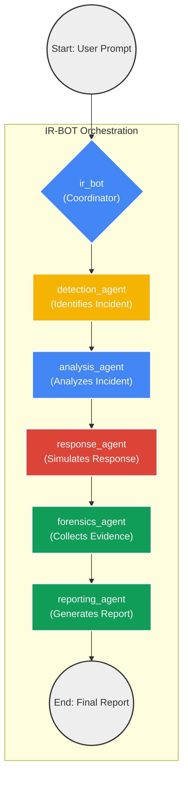

# IR-BOT: A Multi-Agent System for Security Incident Response

This project implements a multi-agent system for automated security incident response using the Google Agent Development Kit (ADK). The system is designed to handle two critical scenarios: a Windows workstation ransomware attack and a website data breach via SQL injection.

## Project Structure

The project is organized into a root agent (`ir_bot`) that coordinates a team of specialized sub-agents:

-   **`detection_agent`**: Identifies security incidents from logs.
-   **`analysis_agent`**: Performs deep-dive analysis of detected incidents.
-   **`response_agent`**: Recommends and simulates containment actions.
-   **`forensics_agent`**: Collects and preserves digital evidence.
-   **`reporting_agent`**: Compiles findings into a comprehensive incident report.

## System Architecture

The diagram below illustrates the flow of tasks between the root `ir_bot` and its sub-agents, optimized for a portrait view with a Google-inspired color theme.



## Setup and Installation

1.  **Clone the repository:**
    ```bash
    git clone https://github.com/kenpkz/adk-soc-demo.git
    cd adk-soc-demo
    ```

2.  **Install dependencies:**
    Make sure you have Python 3.12 or higher installed. Then, install the required packages:
    ```bash
    pip3 install -r requirements.txt
    ```

3.  **Configure environment variables:**
    Create a `.env` file in the root of the project by copying the example file:
    ```bash
    cp .env.example .env
    ```
    Edit the `.env` file and add your Google Cloud project details. It should look like this:
    ```
    GOOGLE_GENAI_USE_VERTEXAI=TRUE
    GOOGLE_CLOUD_PROJECT="Your GCP Project"
    GOOGLE_CLOUD_LOCATION="global"
    GEMINI_MODEL="gemini-2.5-flash"
    ```

## Demo Guide

The application includes two pre-configured demo scenarios that use synthetic logs.

### Running the Application

To start the web interface, run the following command from the project's root directory:

```bash
adk web
```
*Note: You may need to adjust the path to the `adk` executable depending on your Python installation.*

### Scenario 1: Ransomware Attack

This scenario simulates the detection and analysis of a ransomware attack on a Windows workstation.

1.  In the ADK web interface, select the `ir_bot` agent from the dropdown menu.
2.  In the chat input, enter the following prompt to start the analysis of the ransomware logs:

    ```
    Analyze the logs in the folder IR-BOT/data/synthetic_logs/ransomware
    ```
3.  The `ir_bot` will delegate the task to the `detection_agent`, which will read the logs, identify the ransomware activity, and pass its findings to the other agents for analysis, response simulation, and forensic evidence collection.
4.  Finally, the `reporting_agent` will generate a comprehensive report summarizing the incident.

### Scenario 2: SQL Injection Data Breach

This scenario simulates the detection and analysis of a data breach caused by an SQL injection attack.

1.  In the ADK web interface, ensure the `ir_bot` agent is selected.
2.  In the chat input, enter the following prompt to start the analysis of the SQL injection logs:

    ```
    Analyze the logs in the folder /IR-BOT/data/synthetic_logs/sql_injection
    ```
3.  The `ir_bot` will orchestrate the workflow, starting with the `detection_agent` identifying the malicious SQL queries.
4.  The subsequent agents will analyze the attack, suggest response actions, and collect forensic data.
5.  The `reporting_agent` will then produce a final report detailing the data breach.
